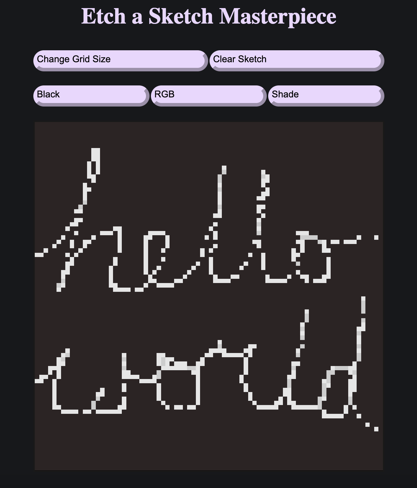
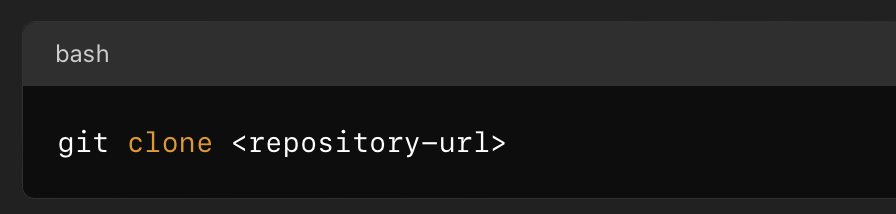
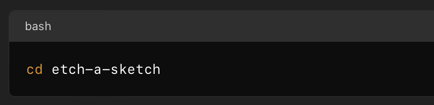

# Etch-a-Sketch Project Documentation

## Overview

Etch-a-Sketch project developed for the Foundations Certification through the Odin Project. This project utilizes JavaScript to power the game's functions, allowing players to create digital drawings with adjustable settings.

## Features

### Grid Size Adjustment

- Players can change the grid size.

- Adjusting the grid size changes the drawing stroke thickness.

- Grid size options range from fine to coarse, providing varied drawing experiences.

### Color Selection

- Players can choose between three color options for their drawings:

    * **Black**: Standard black color for consistent strokes.

    * **RGB**: Random colors for each stroke, providing a vibrant and dynamic drawing experience.

    * **Shade**: Progressive shading effect, darkening with each pass over the same area.

## Technologies Used

- **JavaScript**: Core functionality and interactivity.

- **HTML/CSS**: Structure and styling of the game interface.

## Game Mechanics

### Initialization

- Default grid size set to 16x16.

- Default color set to black.

### Grid Size Adjustment

- Slider or input field provided for players to select desired grid size.

- JavaScript function recalculates and renders the grid based on the selected size.

### Color Selection

- Buttons or dropdown menu provided for players to choose a color mode.

- JavaScript function changes the drawing color mode based on player selection.

### Drawing Logic

- Mouse events tracked to detect drawing actions.

- JavaScript function applies the selected color mode to the grid cells as the player draws.

## How to Play

1\. **Select Grid Size**: Use the slider or input field to choose the desired grid size.

2\. **Choose Color Mode**: Select from Black, RGB, or Shade using the provided options.

3\. **Draw**: Click and drag the mouse over the grid to create drawings.

## Project Setup

1\. Clone the repository from GitHub.
   

2\. Navigate to the project directory.
   

3\. Open `index.html` in a web browser to start the game.

## Contribution Guidelines

- Fork the repository.

- Create a new branch for your feature or bug fix.

- Submit a pull request with a detailed description of your changes.

## Contact Information

For questions or feedback, please contact the project maintainer at [email@example.com].
